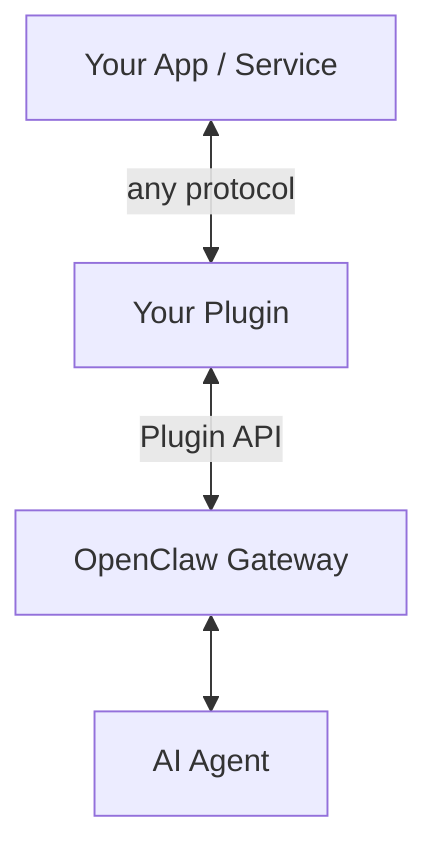

## Building a Channel Plugin for OpenClaw

{{ page.date | date: "%B %-d, %Y" }}

[OpenClaw](https://openclaw.ai) is an open source AI agent gateway — it connects LLMs like Claude to messaging platforms (WhatsApp, Telegram, Discord, iMessage) and gives them tools to actually *do* things: run commands, browse the web, read files, query databases.

But the real power is that it's extensible. If the built-in channels don't cover your use case, you can build your own plugin. That's what this guide is about.

We'll walk through creating a channel plugin from scratch. By the end, you'll have a working plugin installed in your OpenClaw gateway. What you do with it from there is up to you.

### What Can Plugins Do?

The [OpenClaw plugin system](https://docs.openclaw.ai/plugin) supports several types of extensions:

- **Channel plugins** — New communication surfaces (dashboards, chat platforms, custom UIs)
- **Tool plugins** — New capabilities for your agent (APIs, hardware, databases)
- **CLI commands** — Custom commands for the `openclaw` CLI
- **Background services** — Long-running processes alongside the gateway
- **Auto-reply commands** — Slash commands that execute without invoking the AI

This guide focuses on **channel plugins** — the most common type. A channel plugin gives your agent a new way to talk to the world.

### What People Are Building

The plugin ecosystem is wide open. A few ideas to get your gears turning:

- **Custom dashboards** — like [DashBot](https://github.com/wembledev/dashbot), our open source real-time AI agent dashboard that shows chat, status, and agentic cards in a browser
- **Internal tools** — Slack bots, helpdesk integrations, admin panels
- **IoT bridges** — Home automation, sensor monitoring, hardware control
- **Notification systems** — SMS alerts, email digests, webhook forwarders
- **Platform integrations** — CRM connectors, e-commerce tools, analytics dashboards

Our [dashbot-openclaw](https://github.com/wembledev/dashbot-openclaw) plugin is one example — it connects an AI agent to a Rails dashboard over WebSockets. But your plugin can be as simple or complex as you need.

## Architecture Overview

Here's how a plugin fits into the OpenClaw ecosystem:



The plugin runs **inside the gateway process**. It uses the [OpenClaw Plugin API](https://docs.openclaw.ai/plugin) to register itself, receive messages from the agent, and send messages back. How your plugin communicates with the outside world — HTTP, WebSocket, carrier pigeon — is entirely up to you.

## Prerequisites

- **Node.js 22+** ([download](https://nodejs.org/))
- **OpenClaw** installed and running ([getting started guide](https://docs.openclaw.ai/start/getting-started))
- **Basic TypeScript** knowledge (if you can write JavaScript, you're 90% there)

## Step 1: Project Setup

Create a new directory and initialize the project:

```bash
mkdir my-openclaw-plugin
cd my-openclaw-plugin
npm init -y
```

Install TypeScript and the test runner:

```bash
npm install -D typescript vitest @types/node
```

Generate a TypeScript config:

```bash
npx tsc --init
```

Then update `tsconfig.json` to use modern ES modules:

```json
{
  "compilerOptions": {
    "target": "ES2022",
    "module": "ESNext",
    "moduleResolution": "bundler",
    "outDir": "./dist",
    "rootDir": "./src",
    "strict": true,
    "esModuleInterop": true,
    "skipLibCheck": true,
    "declaration": true
  },
  "include": ["src/**/*"]
}
```

Update your `package.json` to set the module type and scripts:

```json
{
  "type": "module",
  "main": "./dist/index.js",
  "scripts": {
    "build": "tsc",
    "dev": "tsc --watch",
    "test": "vitest run"
  }
}
```

## Step 2: The Plugin Manifest

Every OpenClaw plugin needs an `openclaw.plugin.json` in its root directory. This tells the gateway what your plugin is and how to load it. See the [plugin manifest docs](https://docs.openclaw.ai/plugins/manifest) for the full spec.

Create `openclaw.plugin.json`:

```json
{
  "id": "my-plugin",
  "name": "My OpenClaw Plugin",
  "version": "1.0.0",
  "description": "A custom channel plugin",
  "author": "Your Name",
  "license": "MIT"
}
```

You'll also need to tell OpenClaw where to find your entry point. Add this to your `package.json`:

```json
{
  "openclaw": {
    "extensions": ["./src/index.ts"]
  }
}
```

OpenClaw loads TypeScript files directly at runtime via [jiti](https://github.com/unjs/jiti), so you don't even need to compile during development. The `dist/` build is only needed if you publish to npm.

## Step 3: The Entry Point

Every plugin exports a single `register` function. This is the entire contract between your code and OpenClaw.

Create `src/index.ts`:

```typescript
export default function register(api: any) {
  api.logger.info("Hello from my plugin!");

  api.registerChannel({ plugin: myChannel });
}
```

When the gateway starts, it discovers your plugin, calls `register`, and passes in the [Plugin API](https://docs.openclaw.ai/plugin) object. That API gives you everything you need: logging, config access, channel registration, and more.

## Step 4: Define Your Channel

A channel plugin is an object that describes how your plugin communicates. Here's the minimal structure — see the [channel plugin guide](https://docs.openclaw.ai/plugin#register-a-messaging-channel) for all the options:

```typescript
const myChannel = {
  id: "my-channel",

  meta: {
    id: "my-channel",
    label: "My Channel",
    selectionLabel: "My Channel (custom)",
    docsPath: "/channels/my-channel",
    blurb: "A custom channel plugin for OpenClaw.",
    aliases: ["mine"],
  },

  capabilities: {
    chatTypes: ["direct"],
  },

  config: {
    listAccountIds: (cfg: any) =>
      Object.keys(cfg.channels?.["my-channel"]?.accounts ?? {}),
    resolveAccount: (cfg: any, accountId?: string) =>
      cfg.channels?.["my-channel"]?.accounts?.[accountId ?? "default"] ?? {
        accountId,
      },
  },

  outbound: {
    deliveryMode: "direct" as const,
    sendText: async ({ text }: { text: string }) => {
      // This is called when the agent sends a message
      // through your channel. Do whatever you want here:
      // POST to an API, write to a file, flash a light...
      console.log(`Agent says: ${text}`);
      return { ok: true };
    },
  },
};
```

The key pieces:

- **`meta`** — How your channel appears in the CLI and UI ([docs](https://docs.openclaw.ai/plugin#register-a-messaging-channel))
- **`capabilities`** — What your channel supports (DMs, groups, media, threads)
- **`config`** — How OpenClaw resolves accounts from your channel config
- **`outbound.sendText`** — The function called when the agent needs to send a message through your channel

That `sendText` function is where the magic happens. For a hello-world plugin, logging to the console is fine. For something like [DashBot](https://github.com/wembledev/dashbot), we send messages over WebSocket to a Rails app. For a Slack integration, you'd call the Slack API. It's your code — do what you want.

## Step 5: Putting It Together

Here's the complete `src/index.ts`:

```typescript
const myChannel = {
  id: "my-channel",

  meta: {
    id: "my-channel",
    label: "My Channel",
    selectionLabel: "My Channel (custom)",
    docsPath: "/channels/my-channel",
    blurb: "A custom channel plugin.",
    aliases: ["mine"],
  },

  capabilities: {
    chatTypes: ["direct"],
  },

  config: {
    listAccountIds: (cfg: any) =>
      Object.keys(cfg.channels?.["my-channel"]?.accounts ?? {}),
    resolveAccount: (cfg: any, accountId?: string) =>
      cfg.channels?.["my-channel"]?.accounts?.[accountId ?? "default"] ?? {
        accountId,
      },
  },

  outbound: {
    deliveryMode: "direct" as const,
    sendText: async ({ text }: { text: string }) => {
      console.log(`[my-channel] Agent says: ${text}`);
      return { ok: true };
    },
  },
};

export default function register(api: any) {
  api.logger.info("My plugin loaded!");
  api.registerChannel({ plugin: myChannel });
}
```

Around 40 lines of code. That's a working channel plugin.

## Step 6: Testing

You should test your plugin — even the simple ones. Create `src/index.test.ts`:

```typescript
import { describe, it, expect, vi } from "vitest";
import register from "./index.js";

describe("MyPlugin", () => {
  it("registers a channel", () => {
    const api = {
      logger: { info: vi.fn() },
      registerChannel: vi.fn(),
    };

    register(api);

    expect(api.registerChannel).toHaveBeenCalledTimes(1);
    expect(api.registerChannel).toHaveBeenCalledWith(
      expect.objectContaining({
        plugin: expect.objectContaining({ id: "my-channel" }),
      })
    );
  });
});
```

Run it:

```bash
npm test
```

The [OpenClaw plugin docs](https://docs.openclaw.ai/plugin#testing-plugins) have more details on testing strategies, including how to validate your manifest and test against the real gateway.

## Step 7: Install & Configure

Install your plugin into OpenClaw. For local development, use the `-l` flag to link (no copy):

```bash
openclaw plugins install -l ./path/to/my-openclaw-plugin
```

Or without the link flag to copy it into the extensions directory:

```bash
openclaw plugins install ./path/to/my-openclaw-plugin
```

See [Plugin CLI docs](https://docs.openclaw.ai/plugin#cli) for all install options, including installing from npm.

Now configure your channel. Add this to your OpenClaw config:

```json
{
  "channels": {
    "my-channel": {
      "accounts": {
        "default": {
          "enabled": true
        }
      }
    }
  }
}
```

Restart the gateway:

```bash
openclaw gateway restart
```

Check the logs:

```bash
openclaw logs
```

You should see your "My plugin loaded!" message. When the agent responds through your channel, you'll see the `[my-channel] Agent says: ...` output.

## Going Further

This guide gets you a working plugin. Here's where to go next:

### Add Inbound Messages

A channel that only outputs isn't very useful. To receive messages *into* OpenClaw, you'll want to set up a [gateway service](https://docs.openclaw.ai/plugin#register-background-services) that listens for incoming data (HTTP webhook, WebSocket, polling — whatever fits your use case) and dispatches messages into the agent session.

### Add Gateway RPC Methods

Need to expose custom API endpoints? Register [gateway RPC methods](https://docs.openclaw.ai/plugin#register-a-gateway-rpc-method) that other tools and plugins can call.

### Add CLI Commands

Want a custom `openclaw my-thing` command? Register [CLI commands](https://docs.openclaw.ai/plugin#register-cli-commands) directly from your plugin.

### Add Agent Tools

Give the agent new capabilities with [custom tools](https://docs.openclaw.ai/plugins/agent-tools) — database queries, API calls, hardware control, anything you can code.

### Publish to npm

When your plugin is ready to share, [publish it as an npm package](https://docs.openclaw.ai/plugin#distribution-npm). Others can install it with `openclaw plugins install your-package-name`.

## Real-World Example: DashBot

We built [DashBot](https://github.com/wembledev/dashbot) as a real-time dashboard for our AI agent — chat, status monitoring, and interactive agentic cards, all in a browser.

The [dashbot-openclaw](https://github.com/wembledev/dashbot-openclaw) plugin connects the gateway to DashBot over WebSockets (Action Cable). It handles bidirectional chat, streams agent status data, and relays card interactions. It's a good example of what a more complex channel plugin looks like once you move past hello-world.

Both are MIT licensed and open source under [wembledev](https://github.com/wembledev) on GitHub.

## Resources

- **[OpenClaw Plugin Documentation](https://docs.openclaw.ai/plugin)** — The full reference
- **[OpenClaw Getting Started](https://docs.openclaw.ai/start/getting-started)** — If you're new to OpenClaw
- **[Plugin Agent Tools](https://docs.openclaw.ai/plugins/agent-tools)** — Adding tools to your agent
- **[DashBot](https://github.com/wembledev/dashbot)** — Real-time AI dashboard (Rails 8 + React)
- **[dashbot-openclaw](https://github.com/wembledev/dashbot-openclaw)** — Our plugin source code
- **[OpenClaw on GitHub](https://github.com/openclaw/openclaw)** — The framework itself

---

*The plugin ecosystem is early. The best plugins haven't been built yet. Maybe yours is one of them.*

*Questions? Ideas? Find us on [GitHub](https://github.com/wembledev) or [get in touch](/contact).*
