You've built an AI agent to run your business, assist with your daily life, make things easier. Then the cloud bills arrive.

You're paying $0.15 per 1K tokens just to check if anything broke while you slept. Every. Single. Day.

There's a better way.

## The Problem: Always-On AI Gets Expensive Fast

Most AI agents rely on cloud APIs. When you need your agent to keep helping you—checking email, monitoring your projects, watching your business—you have two terrible options:

**Option 1: Keep calling expensive cloud APIs**
- If your agent checks in every 30 minutes? That's 48 API calls per day.
- At typical 2026 cloud pricing ($0.03 per 1K input tokens), even a 500-token check costs ~$0.0015.
- 48 calls × $0.0015 = ~$0.07 per day, or **~$25.55 per year per agent**.
- 5 agents? ~$128/year. 10 agents? ~$255/year.

*(Note: These are estimates based on current cloud API pricing. Your actual costs may vary based on model choice, token count, and current rates. The point is the relative cost difference.)*

The math gets expensive fast. You're spending money just to keep things *alive*, not to solve actual problems.

**Option 2: Run a constant cloud server**
- Spin up a cloud instance to keep your agent alive 24/7.
- Even the cheapest tier costs ~$5-10/month per instance.
- For production reliability, you probably want redundancy.
- Now you're running $20-50/month on infrastructure that mostly sits idle.

**Option 3: Use a machine you already have**
- You probably have a Mac mini, desktop, or NAS running 24/7 at home or in the office anyway.
- Install Ollama. Run the model there. Let it handle your heartbeats.
- Cost: $0 (it's already running).
- No new infrastructure. No new monthly bill.
- Your agent can check on things without paying cloud providers.

## The Better Way: Local Models on Hardware You Already Own

As our AI agents started multiplying and cloud costs bloomed on every invoice, we got frustrated. A search through X posts, YouTube tutorials, and the OpenClaw agent documentation made it clear: this problem wasn't new, and the solution was obvious.

Option 3: **run a lightweight local LLM on hardware you already have**.

We installed **Ollama** (an open-source LLM runtime) on our Mac mini—the same machine that's been running 24/7 anyway—and deployed a 3-billion-parameter model. No new hardware. No new bill. Here's what changed:

### The Numbers

| Task | Cloud API | Local Model |
|------|-----------|-------------|
| Cost per heartbeat check | ~$0.0015 | $0.00 |
| Annual cost (48 checks/day) | ~$26 | $0 |
| Setup complexity | Minutes | 15 minutes |
| Token limits | API tier dependent | Zero (local) |
| Privacy exposure | Full prompt sent to vendor | Zero |
| Latency | 1-3 seconds | 200-500ms |

**For monitoring alone, you go from $26/year/agent to free.**

At scale (10-50 agents), this is the difference between $260-1,300 annually in pure monitoring overhead *and* free.

> 💡 **Note**: As [@Pranit](https://x.com/Pranit/status/2020207265312305183) points out, cloud API pricing is heavily subsidized right now. Enjoy it while it lasts—but having a local fallback is smart insurance. The party won't last forever.

## Why Local Models Work for Heartbeats

Not every AI task benefits from a local model. Complex reasoning, knowledge synthesis, creative writing—these often need the raw power of GPT-4 or Claude 3 running on massive cloud infrastructure.

But **heartbeat tasks are different**. They're narrow in scope:

- "Check if the server is up"
- "Count unread emails in the support inbox"
- "Is there a deployment failure in CI/CD?"
- "Did any critical issues happen overnight?"
- "What's the current weather?"

These don't require world-knowledge or nuanced reasoning. They need pattern recognition and basic logic. A 3B-parameter model (Llama 3.2:3b) is *perfect* for this.

### How Heartbeats Actually Work

The key insight: **the agent doesn't run the checks—it processes pre-gathered context**.

Every 30 minutes:
1. Your system gathers context: git commits, deployment logs, error counts, inbox summaries, etc.
2. The agent receives that context and asks: "Is anything urgent?"
3. The agent returns: "All clear" or "Alert: X needs attention"
4. If urgent, escalate to you or a more powerful model. Otherwise, sleep.

**Example Heartbeat Input:**
```
Last 30 minutes:
- 3 git commits (all to staging)
- 0 deployment errors
- 0 critical logs
- 12 unread support emails (none tagged urgent)
- System load: 45%
```

**Agent Response:**
```
All clear. Support emails are routine. Commits look normal.
```

---

**Example 2 - With an Issue:**
```
Last 30 minutes:
- 0 git commits
- 2 deployment failures (Fitnito staging build)
- 5 ERROR logs in last 10 min
- 1 critical support email: "Payment processing down"
- System load: 92%
```

**Agent Response:**
```
ALERT: Fitnito build failures + payment processing complaint. 
Escalate to human immediately. High load + deployment issues suggest production risk.
```

The agent just reads context and makes a call: "This looks fine" or "This needs human eyes now."

The agent is just a decision-maker. That's what makes it so fast and cheap.

```mermaid
graph TD
    A["⏰ Every 30 minutes<br/>Timer triggers"] --> B["📊 Gather Context<br/>Git commits<br/>Logs & errors<br/>Email summaries<br/>System metrics"]
    B --> C["🤖 Local Model<br/>Llama 3.2:3B<br/>localhost:11434"]
    C --> D{"Anything<br/>urgent?"}
    D -->|Yes| E["🚨 ALERT<br/>Return: Escalate to human"]
    D -->|No| F["✅ ALL CLEAR<br/>Return: Nothing to do"]
    E --> G["📬 Send Alert<br/>Telegram / Email / Webhook"]
    F --> H["😴 Sleep<br/>Wait 30 minutes"]
    G --> H
    
    style C fill:#90EE90
    style D fill:#FFE4B5
    style E fill:#FF6B6B
    style F fill:#90EE90
```



That's the entire loop. No cloud API calls. No rate limits. All local.

## The Practical Setup

We run **Ollama** (`ollama.ai`) with Llama 3.2:3B on a Mac mini. Here's what that looks like:

```bash
# Install Ollama (brew, apt, or download from ollama.ai)
brew install ollama

# Pull the 3B model (~2GB download)
ollama pull llama3.2:3b

# Expose the API for your agent framework
ollama serve  # Starts on http://localhost:11434/v1
```

The model fits in ~2GB of VRAM. On a Mac mini (or any recent desktop), you have that. On a laptop, it works but slower. On a [Raspberry Pi 5 with extra RAM, it's viable](https://x.com/technewsro_blog/status/2020207102783025393).

Then, in your agent configuration, you swap the cloud endpoint for the local one:

```json
{
  "agents": {
    "heartbeat": {
      "model": "ollama:llama3.2:3b",
      "endpoint": "http://localhost:11434/v1"
    }
  }
}
```

That's it. No API keys. No rate limits. No billing surprises.

## Real-World Impact: Our Setup

Over the past weeks running this setup, here's what actually happened:

- **Cost**: $0 on model inference for heartbeats (vs. ~$150/year on cloud)
- **Latency**: Sub-second heartbeat checks (cloud typically takes 1-3 seconds)
- **Privacy**: 100+ heartbeat checks run with zero data sent to external vendors
- **Reliability**: No API outages affecting our monitoring (only dependent on local hardware)

### The Issues We Hit (And How We Fixed Them)

**Issue 1: Connection Failures in Early Rollout**

When we first wired up Ollama as the heartbeat model, we hit repeated `Connection error` messages. The local model would fail to respond, and heartbeats would retry 4-5 times before backing off.

*Root cause:* We had misconfigured the endpoint in the agent framework. We were trying to hit `localhost:11434` from a containerized environment where "localhost" didn't resolve to the actual host machine.

*Fix:* Changed from `http://localhost:11434/v1` to the actual IP address of the machine running Ollama. For a Mac mini on the home network, that meant `http://192.168.1.104:11434/v1`.

**Lesson:** Local inference isn't truly "local" if your agent isn't actually on the same machine. Plan your architecture accordingly—agent runtime and model runtime need to be co-located or properly networked.

**Issue 2: Memory Bloat Breaking Session Context**

This one caught us off-guard. After a few weeks of heartbeat checks, our agent session state file grew to 75KB. The agent framework has a 20KB limit for injected context in each session.

What happened: The agent couldn't read its own context properly, causing malformed responses and broken message routing. Heartbeats would run successfully, but the *reply* to monitoring channels would fail silently.

*Root cause:* We were logging too much detail. Every heartbeat check got written out verbosely.

*Fix:* Implemented an archival strategy. Keep only the last 1-2 days of detailed logs. Archive older entries to separate files. This brought file size from 75KB down to ~4KB.

**Lesson:** Even with local models, your infrastructure still needs hygiene. Logs bloat. Memory grows. You need an archival/rotation strategy, just like any production system.

**Issue 3: First-Run Model Download**

When you first run `ollama pull llama3.2:3b`, it downloads ~2GB. On a typical home internet connection, that's 10-15 minutes. If you try to use the model before it's fully downloaded, you get cryptic errors.

*Root cause:* We didn't wait for the full model pull to complete before starting the agent.

*Fix:* Simple: run `ollama pull` explicitly, wait for it to finish, *then* start your agent. Add it to your setup checklist.

### What Worked Really Well

- **Zero API rate limits.** Run heartbeats every 30 minutes, every 5 minutes, every minute. Doesn't matter. No cloud quota to worry about.
- **Sub-second latency.** Local inference is *fast*. Your heartbeat completes before the main agent can blink.
- **It just kept working.** Once properly configured, Ollama is stable. No surprise outages, no degraded performance. Just consistent, predictable behavior.

We ran 100+ successful heartbeat cycles without a single API failure or token-limit issue.

## The Hybrid Approach

The sweet spot is **layered intelligence**:

- **Tier 1 (Free)**: Local models for monitoring, status checks, simple logic → Ollama
- **Tier 2 (Cheap)**: Haiku/Claude-3.5-Sonnet for basic tasks, content, drafts → Cloud APIs
- **Tier 3 (Expensive)**: GPT-4, Claude Opus for complex reasoning, architecture, code review → Cloud APIs, used sparingly

Your agent spends 80% of its time in Tier 1 (free), 15% in Tier 2 (cheap), 5% in Tier 3 (expensive).

Compare that to a system that runs all heartbeats on cloud APIs:

- 100% cloud = $20-100/month (5-10 agents doing daily monitoring)
- Hybrid = $0/month for heartbeats + cloud only when you actually need reasoning power

## The Security Advantage

Every API call to a cloud AI vendor sends your prompts and data to their servers. This includes:

- Your system state and metrics
- Your infrastructure details
- Your business logic
- Your alerts and anomalies
- Potentially sensitive customer data

**Your heartbeat is reading everything about your business.**

With a local model, that information never leaves your machine. You get all the benefits of AI-driven monitoring without involuntarily sharing your operational secrets with cloud providers.

This matters especially if you:
- Run a healthcare, finance, or legal business (regulated data)
- Operate in a jurisdiction with strict data residency laws
- Work on proprietary technology you don't want to leak
- Simply prefer not to feed your entire system state to yet another third party

## Why Agents Make This Possible

Traditional software doesn't have "heartbeats." It runs continuously or responds to webhooks.

But **AI agents are different**. They need to make decisions, check context, and decide what to do next. That decision-making can be expensive (requires a powerful model) or cheap (requires a simple model).

By separating the monitoring layer (cheap, local) from the decision/action layer (expensive, cloud), agents can be both intelligent *and* affordable.

## The Future

As open models improve (and they're improving fast), local inference will handle increasingly complex tasks. The 3B models of today will become the utility players of tomorrow. Bigger models will be reserved for what they're actually good at: deep reasoning, synthesis, and creativity.

The cloud AI industry has an economic problem: if everything moves to local inference for routine tasks, their margins evaporate. They'll optimize for specialty use cases and high-value reasoning. That's fine. That's what they should do.

Meanwhile, you save money, improve privacy, and speed up your systems. Everyone wins except the cloud bill.

## Getting Started

1. **Install Ollama**: `ollama.ai` (5 minutes)
2. **Pull a small model**: `ollama pull llama3.2:3b` (10 minutes download, depends on internet)
3. **Point your agent framework at localhost:11434/v1** instead of your cloud endpoint
4. **Run a heartbeat check** and watch it work in sub-second time with $0 cost
5. **Reserve your cloud API budget for what actually needs it**

The future of practical AI isn't "bigger cloud models." It's "smart routing"—knowing when to use expensive intelligence and when to use cheap local logic.

Heartbeats are your first opportunity to prove it.

---

*Built with Ollama (open-source), Llama 3.2:3B (Meta), and the realization that not every AI decision needs to cost money.*

**How We Got Here:**

This post came from frustration with ballooning cloud costs as we scaled our AI agents. We dug into:
- X/Twitter discussions on local models, cost optimization, and what builders are actually doing
- YouTube tutorials on running Ollama and open-source inference
- [OpenClaw documentation](https://docs.openclaw.ai) on agents and heartbeat architecture

The "eureka moment" wasn't invention—it was connecting the dots between cost problems and solutions already out there.

**References & Community Discussion:**

*X/Twitter Posts:*
- [@Pranit](https://x.com/Pranit/status/2020207265312305183) — On API cost subsidies, why cloud pricing won't stay cheap forever
- [@technewsro_blog](https://x.com/technewsro_blog/status/2020207102783025393) — Local AI on PC: what models you can run and hardware requirements
- [@srikeerthandev](https://x.com/srikeerthandev/status/2020207625103905105) — Replacing paid APIs with free/open alternatives (cost savings story)
- [@shubh_dholakiya](https://x.com/shubh_dholakiya/status/2020212998393196923) — On pricing shift: tools ($19/mo) vs employees ($8k/mo) vs agents
- [@grok](https://x.com/grok/status/2020213048535900408) — Real-world OpenClaw agent use cases (email triage, marketing automation, IoT)
- [@K8sArchitect](https://x.com/K8sArchitect/status/2020212480295735600) — OpenCost for Kubernetes cost monitoring (similar principle: measure + optimize)

*Tools & Docs:*
- [Ollama](https://ollama.ai) — The local inference runtime
- [Llama 3.2:3B](https://llama.meta.com) — Meta's 3B parameter model (free)
- [OpenClaw](https://docs.openclaw.ai) — Agent framework & heartbeat documentation
